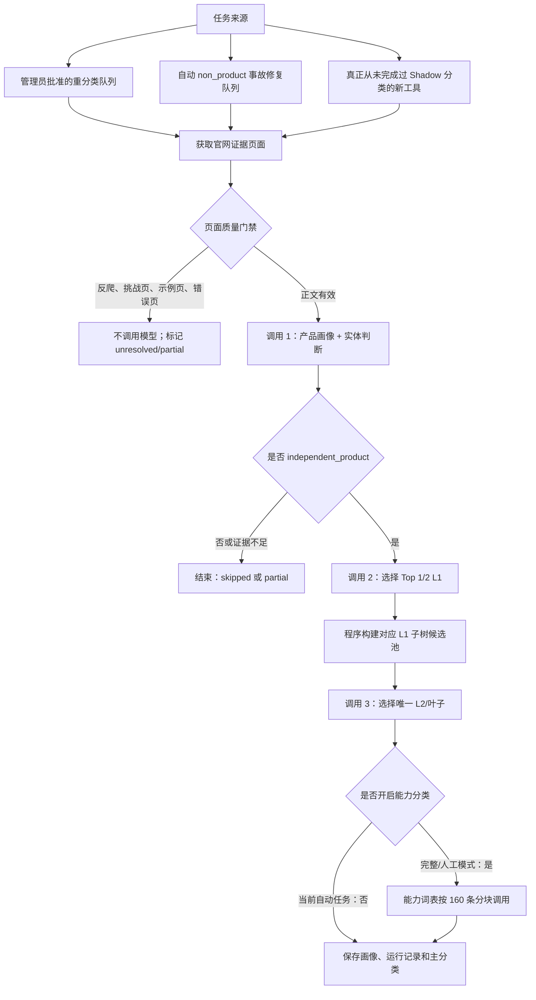

# AI 工具分类逻辑与生产现状报告

> 报告时间：2026-08-15 11:54（Asia/Shanghai）
> 代码基线：`tool-data-runner`，提交 `764a839` 及其前序分类修复
> 数据口径：生产 D1 只读快照；数字会随后台批次继续变化

## 一、执行摘要

当前系统采用一套“实体门禁 → 产品画像 → L1 市场分类 → L2/叶子分类 → 能力分类”的 Shadow 分类流程。它的优点是每一步候选范围受控、结果可审计、人工结论不会被自动任务覆盖；主要问题是同一产品的上下文会被重复发送给模型。

当前自动分类任务关闭了能力分类，因此：

- 反爬页或无效页在模型调用前被拦截，通常为 0 次模型调用。
- 被判断为非独立产品或证据不足的记录，通常为 1 次模型调用。
- 被判断为独立产品的记录，固定执行 3 次模型调用：画像/实体一次、L1 一次、L2/叶子一次。
- 若在完整 Shadow 或人工重分类模式中开启能力分类，还会按能力词表分块追加调用，并可能出现证据补充重试。

这套设计最初是准确率优先：先选 L1，再只在对应子树中选叶子，避免模型跨父级乱选。但在全量批处理中，它造成了调用次数增加、重复输入和额外 token 消耗。下一阶段应把实体、画像、L1、L2 和原始能力合并为一次结构化输出，并由程序执行严格校验；只有少量能力歧义再触发第二次调用。

### 1.1 关于 1,371 条 `non_product` 的重要背景修订

这 1,371 条不是正常业务数据中自然形成的一批“疑似非产品”，也不能直接用来推断实体 schema 把大量真实产品挡掉。它们属于一个根因已经确认的事故批次：分类请求使用的中性传输页 `example.com` 被错误当成产品证据，导致真实产品被批量污染为 `non_product`。

因此该批次的第一处理动作不是付费重算，而是按 incident cohort 做确定性回滚：保留旧运行和输入页面审计、标记其结论已被事故失效、撤销由污染运行写入的自动 `non_product` 断言，并恢复 prior manual/verified 状态；没有可信 prior 状态时回到 `unresolved`。已有 legacy 主分类继续作为业务可用的确定性映射，只将新证据状态标成 `needs_revalidation`。只有高流量、没有任何有效主分类、高风险异常、管理员指定或官网证据实质变化的记录才立即重取证据并调用模型。

这里不能物理删除 `classification_run`，也不能只处理 taxonomy assignment：不少错误记录在实体门禁后即结束，污染主体实际是 `tools.entity_kind=non_product`，并没有该次运行产生的 leaf assignment。正确实现应以 incident/run invalidation 记录保留不可变审计，同时只撤销该运行对当前派生状态的影响。

### 1.2 Legacy crosswalk 的现状修订

Legacy → 新 taxonomy 的基础 crosswalk 已经由迁移 `0032` 完成：旧 `categories` 通过 `taxonomy_terms.source_category_id` 映射到 taxonomy term，旧主分类以 `source=legacy`、`decision_status=legacy` 零模型导入。生产核对显示，当前活动 taxonomy v2 下的 1,672 条 legacy-only 工具全部存在唯一的 `source_category_id` 精确映射，未映射数量为 0。

所以这批数据不是“完全未进入新 taxonomy”，而是“已经确定性映射，但尚未由新官网证据流程重新验证”。市场统计可以继续使用这些 legacy 映射；模型预算应优先用于没有任何主分类、高流量或映射有歧义的记录，而不是全量重跑 1,672 条长尾。

## 二、分类对象和关键概念

### 2.1 实体类型（Entity Kind）

系统先判断页面代表的对象是否有资格进入产品市场分类。当前支持以下实体类型：

| 实体类型 | 含义 | 是否继续市场分类 |
|---|---|---:|
| `independent_product` | 可独立注册、定价、比较的产品或品牌 | 是 |
| `product_module` | 某个母产品内部的模块 | 否 |
| `feature_landing` | 功能页、关键词页或 SEO 落地页 | 否 |
| `company_site` | 公司或多产品门户，不是具体产品 | 否 |
| `app_or_extension` | App、桌面端或浏览器扩展，等待目录政策处理 | 否 |
| `regional_mirror` | 地区、语言或区域镜像 | 否 |
| `duplicate_alias` | 重复记录或别名 | 否 |
| `non_product` | 博客、文档、招聘、状态页等非 AI 产品 | 否 |
| `unresolved` | 证据不足，不能可靠判断 | 否，进入复核或后续重试 |

只有 `independent_product` 会继续进入 L1、L2 和能力分类。人工保存的实体判断具有最高优先级，自动任务不能覆盖人工结论。

### 2.2 主分类（Primary Category）

主分类表达产品最核心的市场定位：

- L1：顶级市场大类。
- L2/叶子：L1 下更具体的市场分类；最终主分类必须是有效叶子节点。若某个 L1 本身没有子节点，它也可以作为叶子。
- 一个产品只保留一个有效主分类，模型可以在 L1 阶段返回 Top 1 或 Top 2 候选，但最终必须裁决为一个叶子。

### 2.3 能力分类（Capabilities）

能力分类表达“产品能做什么”，可以有多个，与唯一主分类不同。当前最多接受 8 个能力，每个能力必须：

- 命中当前有效能力词表中的精确 slug；
- 置信度不低于 0.40；
- 带有来自官网正文的独立证据；
- 通过程序的去重和白名单校验。

## 三、当前生产分类流程



### 3.1 任务选择与优先级

任务按以下优先级进入分类 Worker：

1. 管理员审核通过并入队的重分类请求；
2. 自动标记为 `non_product` 的事故修复队列，以及历史上曾让 Workers AI 参与分类的事故记录；
3. 普通 backlog，即从未出现过任何 Shadow 终态的新工具。

普通 backlog 只允许状态为 `pending_enrich`、`pending_review` 或 `published`，要求有域名、不是重复工具，并且实体为 `independent_product` 或非人工锁定的 `unresolved`。

此前普通 backlog 错误地以“是否存在当前 prompt 版本结果”为判断条件。prompt 一升级，已有旧版本终态的工具就会被当成新任务重新执行。现已改为：只要历史上存在任意 `shadow-%` 的 `succeeded`、`partial` 或 `skipped` 终态，普通 backlog 就不会自动重开；模型或 prompt 升级必须通过明确的事故队列、管理员队列或专项回填任务触发。

当前失败重试预算为同一 prompt、同一主模型最多 3 次。事故队列优先于普通 backlog，每批默认最多 50 条，并发为 3；事故批次完成后至少等待 300 秒，给管理员观察和关闭任务的时间。

### 3.2 官网证据获取与页面质量门禁

系统优先使用经过验证并标记为 taxonomy evidence 的官方来源 URL，否则使用工具的 `official_url`。浏览器获取页面后，会先执行页面质量检查，再决定是否调用模型。

当前重点拦截：

- `Access Denied`、`Access has been blocked`；
- `Just a moment`、`Just wait`；
- `Checking your browser`、`Verify you are human`；
- Cloudflare Ray ID、challenge-platform；
- Incapsula、DataDome、PerimeterX、Sucuri 等 WAF/验证页；
- `example.com`、IANA 示例域名等中性传输页；
- 无有效正文、错误页或不可访问页面。

门禁命中后，不允许把反爬文案交给模型当作产品事实，也不允许据此接受 `non_product`。对于历史上错误自动标记为 `non_product` 的记录，如果这次仍无法取得有效证据，系统会先撤销错误断言并降为 `unresolved`，保存一次 `partial`，避免同一阻断页面连续付费重试三次。

### 3.3 调用 1：产品画像与实体判断

第一次模型调用只使用清洗后的官网主正文，输出：

- 实体类型、置信度、原因和原文证据；
- 产品核心任务 `primary_job`；
- 主要输出 `primary_outputs`；
- 原始能力描述 `capabilities_raw`；
- 其他用于后续分类的证据化产品事实。

实体自动接受条件为：

- 候选不是 `unresolved`；
- 置信度至少 0.80；
- 至少有一条能够在本次官网正文中定位的证据；
- 证据和原因不包含反爬页、错误页或中性示例页信号。

未满足条件时一律降为 `unresolved`。若实体不是 `independent_product`，流程在这里结束，不再调用 L1、L2 或能力分类。

### 3.4 调用 2：L1 Top 1/2

第二次调用输入产品画像和全部有效 L1 定义，要求模型：

- 只返回分类目录中存在的精确 slug；
- 返回最匹配的 1 至 2 个 L1；
- 以产品的主要市场定位为准，而不是附带功能；
- 遵守每个分类节点的 definition、includes 和 excludes。

程序会删除不存在的 slug、重复项和超过两个的候选。没有有效 L1 时，运行结果为 `partial`，错误为 `l1_empty`。

### 3.5 调用 3：L2/叶子裁决

程序根据已接受的 L1 在本地构建叶子候选池：

- 如果 L1 有子节点，只提供其子节点；
- 如果 L1 没有子节点，允许 L1 自身作为叶子；
- Top 2 L1 的候选池会合并去重。

第三次调用只能从这个候选池中选择一个精确叶子 slug。返回结果还要经过本地校验：slug 必须存在于候选池、必须是叶子、不能跨 L1 父级。

主分类状态规则：

| 叶子置信度 | 状态 |
|---:|---|
| ≥ 0.50 | `auto_accepted`，可成为有效主分类 |
| 0.35–0.49 | `provisional`，等待人工审核 |
| < 0.35 | `unresolved` |

若已存在人工 `verified` 主分类，新自动结果只保留审计记录并标记为 `superseded`，不能与人工 Gold 竞争。

### 3.6 能力分类的现状

生产自动 Worker 当前明确使用 `include_capabilities=False`，所以本次 1,300 多条事故重分类不会调用能力分类。当前常规独立产品的 3 次调用，仅包括画像/实体、L1、L2。

完整 Shadow 或人工模式如果开启能力分类，会评估所有有效能力词条。为避免单次白名单过大，系统按每 160 条能力分块，每块调用一次模型。若模型只返回没有独立证据的字符串，系统不会直接接受，而是将这些字符串缩成小候选集，再进行一次证据补充调用。

因此，开启能力分类后的调用上限不是固定的“再调用一次”，而是：

`画像 1 次 + L1 1 次 + L2 1 次 + ceil(能力词条数 / 160) 次 + 必要的证据补充重试`

这也是当前架构不适合直接全量开启能力分类的主要原因。

### 3.7 数据写入与审计

流程主要写入：

- `product_profiles`：证据化产品画像；
- `classification_runs`：模型、prompt、候选、原始输出、状态和错误；
- `product_taxonomy_assignments`：主分类和能力分配；
- `tools.entity_kind` / `entity_kind_source`：自动或人工实体结论。

写主分类时，运行记录先以 `partial` 保存；只有画像、分配和 supersede 操作全部完成后，才更新为最终 `succeeded` 或 `partial`，避免远程写入中断时出现“记录显示成功但分类没写完”。

Shadow 流程不应修改 legacy 的 `tools.primary_category_id` 和 `tool_categories`。每次运行前后都会对 legacy 状态做快照；若发生意外修改，运行会标记为失败并记录 `legacy_mutated`。

## 四、自动发现和人工重分类闭环

系统每次批处理都会尝试扫描分类污染，主要检查历史产品资料、分类原始输出和官网来源中是否包含反爬或中性示例页文本。当前自动检测器包括：

- WAF/挑战页文本污染；
- `example.com` 等中性传输页污染；
- legacy 分类缺少来源证据；
- 最新新流程仍为 unresolved；
- 当前分类与可用官网元数据冲突；
- 反爬文案导致错误命中安全/合规分类等高风险组合。

候选按分值形成低、中、高风险异常。管理员审核后才进入 `classification_reprocess_requests` 队列；Worker 会优先消费该队列。重分类结果可能为：

- `succeeded`：证据充分且达到自动接受条件；
- `needs_manual`：有结果但置信度不足或存在歧义；
- `failed`：抓取、模型或写入失败。

管理员保存的实体和主分类是最终 Gold，不会被后续自动任务覆盖。

## 五、当前生产数据快照

截至 2026-08-15 11:54：

| 指标 | 数量 | 说明 |
|---|---:|---|
| 已发布且非重复工具 | 3,216 | 当前目录规模 |
| 已使用新主分类（verified/auto_accepted） | 1,519 | 约 47.2% |
| 只有 legacy 主分类 | 1,677 | 约 52.1% |
| 没有有效主分类 | 20 | 约 0.6% |
| 当前自动 `non_product` | 1,312 | 会随事故修复持续下降或被确认 |
| 当前 `unresolved` | 495 | 包含证据不足、页面不可用及修复降级记录 |
| V4 新批次运行记录 | 27 | 8 succeeded、12 partial、7 failed |
| V4 产生的新有效主分类 | 8 | 与当前 succeeded 数一致 |
| V4 中 Workers AI 参与次数 | 0 | 已完全排除 |
| 历史上曾让 Workers AI 参与事故分类的工具 | 59 | 已纳入新版本重跑条件 |
| 当前事故选择集合 | 1,371 | 动态集合，实体被修正后会变化 |
| 当前尚无 V4 终态的事故记录 | 1,347 | failed 不算终态，仍受最多 3 次预算约束 |
| 管理员重分类队列 | 0 | 查询时 queued/running/needs_manual/succeeded 均为 0 |

需要注意：“拥有有效主分类”不等于“已经使用新分类逻辑”。legacy-only 的 1,677 条虽然页面可以显示旧分类，但尚未完成新流程，因此这两种覆盖率必须分开统计。

同时，当前 `non_product` 数量主要受已知 `example.com` 事故影响，不能作为正常实体模型质量的直接统计指标。后台应单独显示 incident cohort、事故外 `non_product`、事故外 `unresolved`，避免再次误读。

## 六、已经修复的问题

### 6.1 反爬页面被当成产品事实

已增加常见反爬签名、页面质量门禁、证据落地验证和自动异常扫描。反爬页不再允许直接形成 `non_product` 或主分类结论。

### 6.2 Cursor、Kimi 等产品被判为非产品

根因是错误/中性传输页面的文本进入实体判断，且旧实体结果缺少足够证据约束。现在实体自动接受必须达到 0.80、必须有官网正文证据，并且任何错误页或反爬信号都会强制 unresolved。

### 6.3 prompt 升级触发普通 backlog 全库重跑

今天曾处理的 1,521 个工具中，有 1,503 个已经存在旧 Shadow 终态，真正首次分类的只有 18 个。旧选择条件把“没有当前 prompt 版本”错误等同于“从未分类”，造成重复模型调用。该条件已修复，普通 backlog 现在只处理从未有任何 Shadow 终态的工具。

### 6.4 L1/叶子降级到 Workers AI

Workers AI 已从分类模型链和默认 fallback 中移除。即使环境变量仍显式配置了 Workers AI，分类客户端也会将其排除。没有可信模型时任务直接失败，不再静默降级。V4 生产运行中已确认 Workers AI 参与数为 0。

## 七、当前架构的主要问题

### 7.1 同一工具固定调用三次

对独立产品而言，产品画像会先从官网正文生成，之后又以压缩形式分别发送到 L1 和 L2 调用。虽然每次候选更小，但存在重复上下文、重复等待和重复输出开销。

### 7.2 能力分类的分块调用数量过大

完整能力目录被按 160 条逐块评估。即使每次输出很短，所有能力定义都要反复输入。若能力目录接近 1,000 条，一个产品可能仅能力阶段就需要 7 次左右调用，证据格式错误时还会增加重试。

### 7.3 调用次数和 token 使用缺少逐阶段账本

当前运行记录能辨认 profile、L1、leaf 和 capability 阶段是否执行，但没有形成统一、可聚合的逐阶段 input token、output token、缓存命中和实际费用账本。这导致费用异常发生后，需要通过运行字段和供应商请求数反推。

## 八、建议的目标方案：默认一次调用

### 8.1 一次结构化输出

建议将默认分类请求改为一个 `taxonomy_decision` 调用，同时返回：

```json
{
  "entity": {
    "kind": "independent_product",
    "confidence": 0.93,
    "reason": "...",
    "evidence": [{"quote": "..."}]
  },
  "profile": {
    "primary_job": {"value": "...", "evidence": [{"quote": "..."}]},
    "primary_outputs": [],
    "capabilities_raw": []
  },
  "primary": {
    "l1_slug": "...",
    "leaf_slug": "...",
    "confidence": 0.86,
    "reason": "...",
    "evidence": [{"quote": "..."}]
  }
}
```

请求中提供完整但紧凑的主分类树。模型一次选择 L1 和叶子，程序仍执行全部硬校验：

- L1 和 leaf 必须存在；
- leaf 的父节点必须等于返回的 L1；
- leaf 必须是有效叶子；
- 证据必须能在官网正文中定位；
- 非独立产品不得写主分类；
- 人工 Gold 不得被覆盖。

因此，减少调用次数不等于放弃分类树约束。原来依靠第二次、第三次调用实现的约束，应转移到一次输出后的程序验证。

### 8.2 能力分类采用“本地候选召回 + 例外补判”

不建议把近千条完整能力目录直接塞进同一个请求。这样虽然请求数变成一次，但输入 token 和选择噪音可能更大。

推荐流程：

1. 第一次调用返回带证据的 `capabilities_raw`；
2. 程序用名称、同义词、includes/excludes 和文本相似度，在本地召回少量能力候选；
3. 精确或高置信匹配直接形成 provisional 能力；
4. 只有无法唯一映射的少数能力，才进行一次小候选集补判；
5. 补判失败进入人工复核，不再扫描完整能力目录。

目标调用模型应为：

| 场景 | 目标调用次数 |
|---|---:|
| 反爬页、错误页、无正文 | 0 |
| 明确非产品或证据不足 | 1 |
| 正常独立产品，主分类和能力可本地映射 | 1 |
| 能力存在少量歧义 | 最多 2 |

### 8.3 增加调用级成本与质量观测

每次模型请求应保存：

- `tool_id`、`run_id`、阶段和模型；
- input/output/cached/reasoning token；
- 请求耗时、重试次数和结束原因；
- schema 校验结果；
- L1/leaf 是否被本地校验拒绝；
- 人工最终答案与自动答案是否一致。

后台应直接展示每个工具的调用次数和每个批次的阶段分布，避免再次依赖供应商总请求数推断原因。

## 九、建议实施顺序

### P0-1：先修复流量覆盖，而不是顺序补长尾

当前没有活动的 Market Snapshot，但使用最新的 2026-07 Similarweb 月度事实表计算：新证据主分类覆盖 22.10% 流量，legacy-only 再覆盖 6.86%，合计约 28.96%。流量缺口高度集中：ChatGPT、Gemini、Perplexity 三个无有效主分类工具约占总流量 70.6%。只要先人工或高质量修正这三个，流量主分类覆盖即可接近 99.6%。

因此后台至少同时展示四组口径：Taxonomy coverage、Evidence-verified coverage、Traffic coverage，以及按市场统计的 Top-K category coverage。重分类队列默认按最新月访问量降序，高流量无分类工具优先于普通长尾。由于当前没有活动的 Market Snapshot，流量指标还必须显示实际采用的月份和数据源，不能把临时月度事实悄悄当成当前快照。

### P0-2：把 `example.com` 事故作为独立 cohort 收口

先暂停该 cohort 的默认付费重分类，再执行可重复、可 dry-run 的批量回滚：

- 通过污染输入、事故标记和 run provenance 锁定 cohort，不能仅按当前 `entity_kind` 反查；
- 旧 run 永久保留，在独立 invalidation 记录中写入 incident ID、原因、操作者和时间；
- 只撤销该 run 写入的自动实体结论，人工实体和人工 Gold 永不覆盖；
- 若污染 run 产生过 assignment，将其标为 `superseded`；没有 assignment 时仍必须恢复实体状态；
- 优先恢复最近一次 manual/verified 状态；否则回到 `unresolved`，但继续使用已有 legacy mapping；
- 以 `(incident_id, run_id/tool_id)` 唯一约束保证脚本幂等，并在 apply 前输出 before/after 计数。

回滚过程应为 0 次模型调用。回滚后只重新处理高流量、无有效 primary、高风险异常、管理员指定和证据哈希实质变化的记录。随后再对事故外残留的 100 条 `non_product` 和 100 条 `unresolved` 分来源抽样，评估真实实体误判率。

### P0-3：将 Entity Kind 拆成正交维度

在不破坏现有字段的前提下新增：

- `entity_scope`：`standalone_product`、`product_module`、`product_suite`、`organization`、`non_product`、`unresolved`；
- `tool_distribution_channels`：`web`、`desktop`、`mobile`、`browser_extension`、`api` 等多值渠道；
- `tool_relationships`：`module_of`、`feature_page_of`、`regional_mirror_of` 等父子/归属关系。

`page_role` 不属于 Tool，而属于 URL 对应的 evidence source/page snapshot；同一产品可以同时拥有 canonical、feature、pricing、docs 和 store listing 页面。优先扩展现有来源/快照结构，记录 `url`、`page_role`、`canonical_status`、`content_hash` 和 `evidence_quality`，避免再造一套互相竞争的页面表。

`catalog_eligibility` 不是模型事实，不允许模型直接输出；程序根据 `entity_scope`、页面角色、canonical/duplicate 关系和目录政策确定 `include/exclude/unresolved`，并校验逻辑冲突。`app_or_extension` 不再作为产品排除类型，而是 distribution channel。现有 `duplicate_of_tool_id` 继续表示真正的重复记录，不应被模块或地区镜像关系复用。

### P0-4：增加调用账本和增量触发器

记录每次调用的阶段、input/output/cached/reasoning token、耗时、重试和 schema 结果，并给每个批次设置调用/token 上限。重分类只由官网证据哈希实质变化、相关 taxonomy 子树变化、人工请求、异常检测或 canonical 关系变化触发；全局 prompt 版本变化不得自动重开全库。

### P1-1：Evidence block ID

官网正文清洗后按页面快照切成证据段，模型只返回快照级 `evidence_ids`，例如 `EV82391:P018`，不能只返回会随页面改版漂移的 `P018`。每段保存 `page_snapshot_id`、`block_index`、`block_hash` 和 `normalized_text`；程序对 ID、hash 和归属关系做确定性校验，减少输出 token 和 quote 改写导致的匹配失败。画像版本、证据哈希、taxonomy 版本和分类器版本分别保存，taxonomy 更新不应强制重新生成画像。

### P1-2：Local Top-K leaf → 单次 Judge

候选召回不能依赖尚未生成的 LLM 产品画像。首次分类直接使用标题、meta description、清洗后的官网正文、URL、legacy/source category、确定性关键词和 embedding，在本地混合召回 Top 5–10 个叶子。唯一一次 Judge 接收原始证据块和候选叶子，一次输出 `entity_scope`、产品画像、唯一 `leaf_slug`、可选 secondary leaves、关系事实和 evidence IDs。L1 不再由模型输出，程序根据 leaf 的父节点确定；`catalog_eligibility` 同样由程序策略推导。`none_of_above`、低决策质量或证据冲突才进入第二次 Judge/人工复核。

自动接受不能只看模型自报 confidence。最终 `decision_quality` 应结合 Gold 校准后的模型分数、候选第一二名 margin、证据质量、legacy/source-category 一致性、`none_of_above` 和规则冲突。

### P1-3：Secondary markets 复用现有 assignment 表

不新增 `secondary_market_slugs` 字符串字段。现有 `product_taxonomy_assignments` 已支持同一 `primary_category` 维度下 `is_primary=0` 的非主分配，可用于最多 2–3 个 secondary markets。市场聚合只计算 `is_primary=1`，搜索和 discovery 可以同时使用主市场与 secondary markets。

### P1-4：建立 Gold Regression Set 再切换单次 Judge

固定至少 300 个经过人工确认的 Gold 工具，覆盖 standalone SaaS、mobile app、browser extension、product suite、company site、feature landing、regional mirror、duplicate、non-product、WAF 页面、跨 L1 易混淆项和多用途超级产品。每次分类器、prompt、模型或 taxonomy 规则变化都离线评估 entity accuracy、primary leaf accuracy、cross-L1 error、abstain rate、false non-product rate 和 human override rate。单次 Judge 达不到旧三段流程的 Gold 指标时不得全量替换。

### P2：能力分类继续退出生产关键路径

维持 `include_capabilities=False`。先把 Primary/Secondary Market、流量覆盖和实体解析做好；能力目录改为本地候选召回后，再只对少量歧义进行补判，不恢复全量分块扫描。

## 十、结论

当前分类流程在证据约束、分类树合法性、人工保护和事故复核方面已经形成完整闭环，但实体维度仍不够正交，批量优先级也没有按业务流量排序。

修订后的优先级不是简单把三条 prompt 拼成一条：先修复最高流量的分类缺口并收口 `example.com` 事故，再拆分实体维度、建立调用账本和增量触发器；随后用本地 Top-K leaf + 单次模型 Judge 替代 L1/L2 两段调用。这样既能提高 Sigpik 市场数据的业务可用性，也能把模型从“分类系统本身”降为只处理模糊案例的 Judge。
